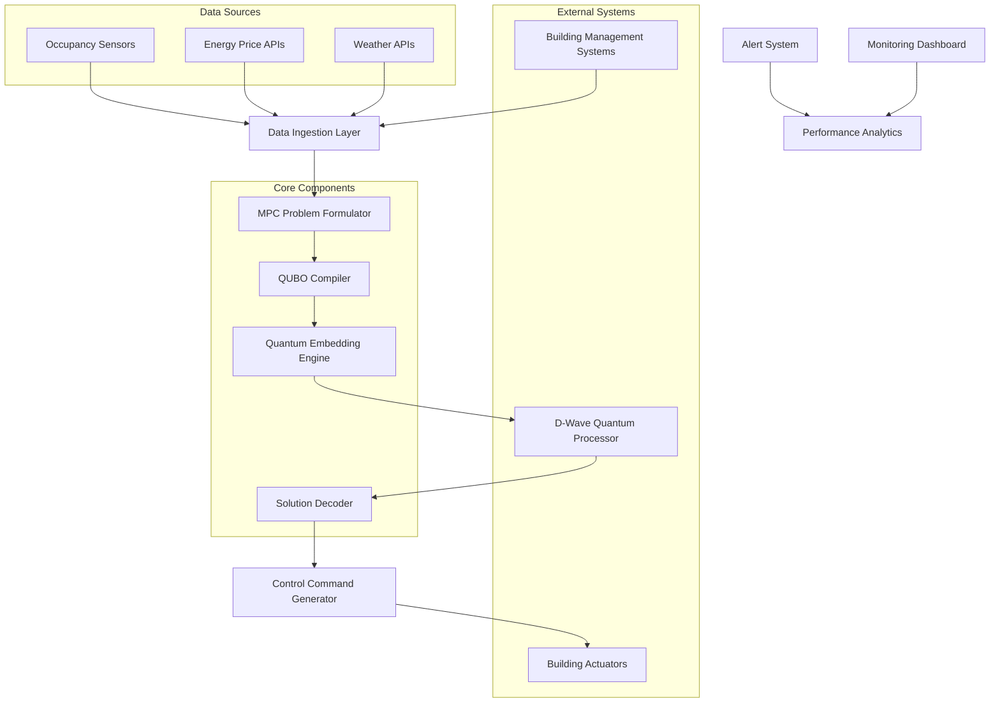
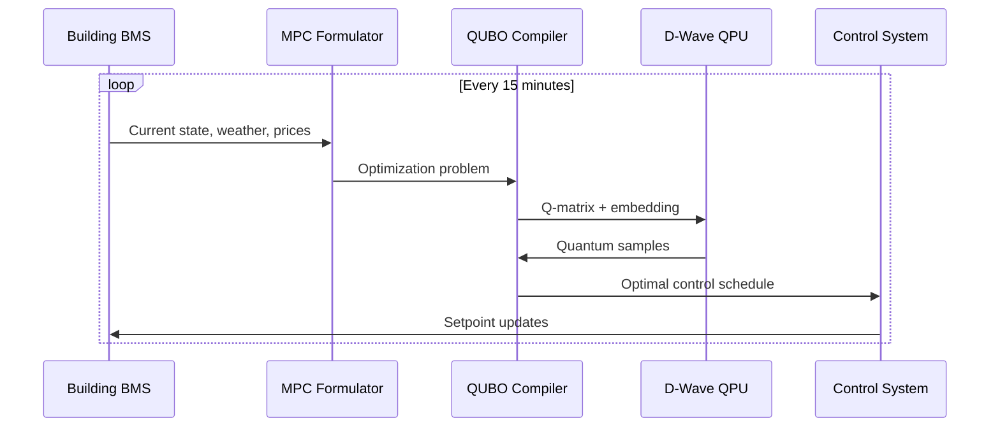
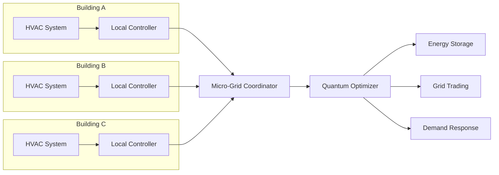

# Quantum-Anneal-CTL Architecture

## System Overview

Quantum-Anneal-CTL is a distributed quantum computing framework that transforms Model Predictive Control (MPC) problems into Quadratic Unconstrained Binary Optimization (QUBO) problems, leveraging D-Wave quantum annealing for real-time HVAC optimization.

## High-Level Architecture



## Core Components

### 1. MPC Problem Formulator
- **Purpose**: Converts building dynamics and constraints into mathematical optimization problems
- **Key Classes**: `MPCController`, `BuildingModel`, `ConstraintManager`
- **Inputs**: Building state, weather forecasts, energy prices, occupancy data
- **Outputs**: Mathematical MPC formulation with dynamics and constraints

### 2. QUBO Compiler
- **Purpose**: Transforms MPC problems into quantum-ready QUBO format
- **Key Classes**: `MPCToQUBO`, `PenaltyWeightOptimizer`, `VariableEncoder`
- **Algorithm**: Penalty method for constraint handling
- **Output**: Q-matrix suitable for quantum annealing

### 3. Quantum Embedding Engine
- **Purpose**: Maps logical QUBO variables to physical qubits
- **Key Classes**: `ChimeraEmbedder`, `PegasusEmbedder`, `AdaptiveEmbedder`
- **Optimization**: Minimizes chain length and maximizes connectivity
- **Fallback**: Hybrid classical-quantum decomposition for large problems

### 4. Solution Decoder
- **Purpose**: Converts quantum samples back to control commands
- **Key Classes**: `SolutionDecoder`, `ConstraintValidator`, `PostProcessor`
- **Error Handling**: Chain break recovery and constraint violation repair

## Data Flow Architecture

### Real-Time Control Loop



### Micro-Grid Coordination



## Technology Stack

### Quantum Computing
- **Primary**: D-Wave Advantage (5000+ qubits)
- **Hybrid**: D-Wave Hybrid Solver Service
- **SDK**: Ocean SDK (dimod, dwavebinarycsp, dwave-system)
- **Fallback**: Simulated annealing for development/testing

### Core Framework
- **Language**: Python 3.9+
- **Numerical**: NumPy, SciPy, CVXPY
- **ML/Optimization**: scikit-learn, OR-Tools
- **Time Series**: pandas, asyncio

### Building Integration
- **Protocols**: BACnet, Modbus, MQTT
- **Communication**: asyncio, paho-mqtt
- **Data Storage**: InfluxDB, PostgreSQL
- **Caching**: Redis

### Deployment
- **Containerization**: Docker, Docker Compose
- **Orchestration**: Kubernetes (optional)
- **Monitoring**: Prometheus, Grafana
- **Logging**: structured logging with JSON format

## Security Architecture

### Data Protection
- **Encryption**: TLS 1.3 for all communications
- **API Keys**: Secure vault storage (HashiCorp Vault or AWS Secrets Manager)
- **Building Data**: Encrypted at rest with AES-256
- **Access Control**: RBAC with JWT tokens

### Network Security
- **Segmentation**: Isolated building networks
- **VPN**: Site-to-site VPN for multi-building deployments
- **Firewall**: Whitelist-only approach for external connections
- **Monitoring**: Real-time intrusion detection

## Scalability Design

### Horizontal Scaling
- **Problem Decomposition**: Temporal and spatial partitioning
- **Load Balancing**: Round-robin QPU access
- **Caching**: Intelligent solution caching with similarity matching
- **Database Sharding**: Time-series data partitioning

### Performance Optimization
- **Warm Starts**: Solution history for faster convergence
- **Adaptive Sampling**: Dynamic num_reads based on problem complexity
- **Embedding Cache**: Reuse embeddings for similar problems
- **Async Processing**: Non-blocking I/O for all external communications

## Quality Assurance

### Testing Strategy
- **Unit Tests**: 90%+ coverage for core algorithms
- **Integration Tests**: End-to-end BMS simulation
- **Quantum Tests**: Mock D-Wave sampler for CI/CD
- **Performance Tests**: Benchmarking against classical MPC

### Monitoring
- **Metrics**: Solution quality, computation time, constraint violations
- **Alerts**: QPU connectivity, embedding failures, control anomalies
- **Dashboards**: Real-time building performance visualization

## Deployment Patterns

### Single Building
```yaml
services:
  quantum-ctl:
    image: quantum-anneal-ctl:latest
    environment:
      - DWAVE_API_TOKEN=${DWAVE_TOKEN}
      - BUILDING_CONFIG=/config/building.yaml
    volumes:
      - ./config:/config
      - ./data:/data
```

### Micro-Grid Cluster
```yaml
services:
  coordinator:
    image: quantum-anneal-ctl:coordinator
    replicas: 1
    
  building-controller:
    image: quantum-anneal-ctl:controller
    replicas: 3
    
  quantum-gateway:
    image: quantum-anneal-ctl:gateway
    replicas: 2
```

## Error Handling & Recovery

### Quantum System Failures
- **QPU Unavailable**: Automatic fallback to hybrid solver
- **Chain Breaks**: Real-time embedding adjustment
- **Poor Solutions**: Classical refinement post-processing

### Building System Failures
- **Sensor Outage**: State estimation using building model
- **Communication Loss**: Local autonomous control mode
- **Actuator Failure**: Constraint-aware replanning

## Future Architecture Considerations

### Quantum Advantage Expansion
- **Gate-Model Integration**: QAOA for discrete optimization
- **Quantum Machine Learning**: Predictive maintenance
- **Error Correction**: Fault-tolerant quantum computing

### Advanced Features
- **Digital Twin**: Real-time building model updates
- **AI Integration**: Reinforcement learning for adaptive control
- **Blockchain**: Peer-to-peer energy trading settlement